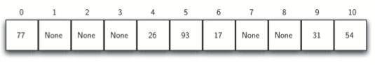
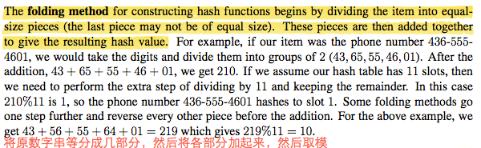
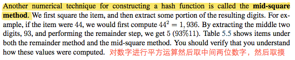
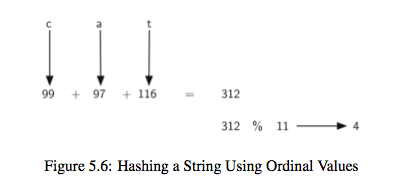
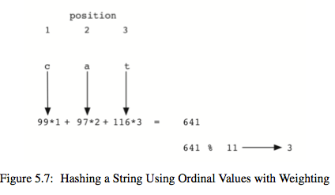
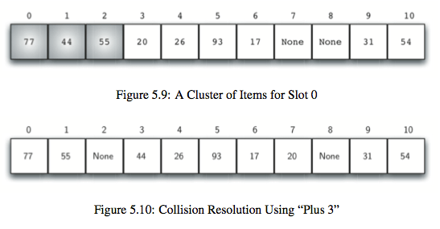
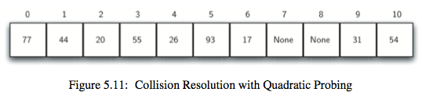
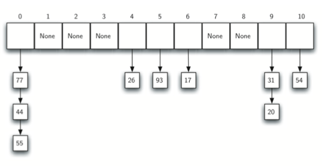
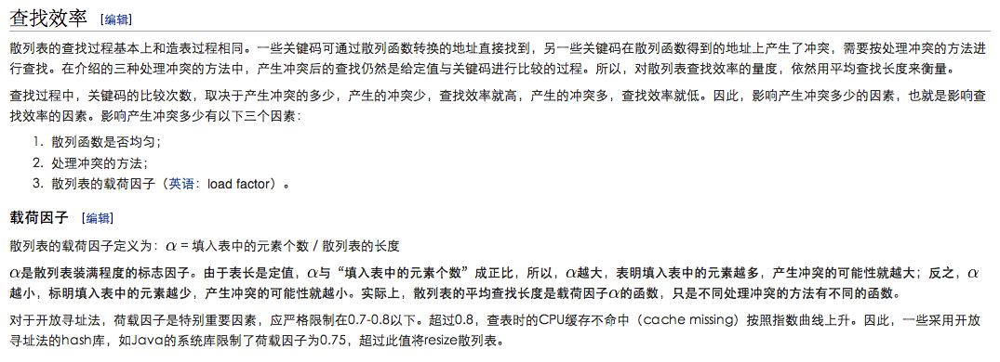

# 搜索

## 1.哈希函数

### 1.1 reminder method

取余数（size=11，下图对11取余数，例如17取余数得到6）

### 1.2 folding method

分组求和再取余数

### 1.3 mid-square method

平方值的中间两位数取余数

### 1.4 字符
对于由字符的元素可以尝试使用 ord 函数来将字符串转换成一个有序的数值序列。

在Python中ord函数可以得到对应字符的ASCII码值。将所有字符的码值累加再取余数。

但是，对于通过回文构词法构成的字符串它们得到的值总是一样，为了解决这个问题，可以根据字符的位置添加一个权重。

##　2.解决冲突(Collision Resolution)

### 2.1 open address(开放寻址)
线性探测(linear probing)下一个位置，缺点是容易造成聚集现象(cluster)，解决聚集现象的办法是跳跃式地查找下一个空槽。

数值的顺序：(54, 26, 93, 17, 77, 31, 44, 55, 20).

### 2.2 quadratic probing(平方探测)

一开始的hash值为h，如果不是空槽，那就尝试h+1，还不是空槽就尝试h+4，依次继续尝试h+9，h+16等等。

### 2.3 chain
利用链表链接起来

## 3.查找效率

