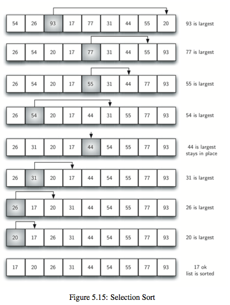
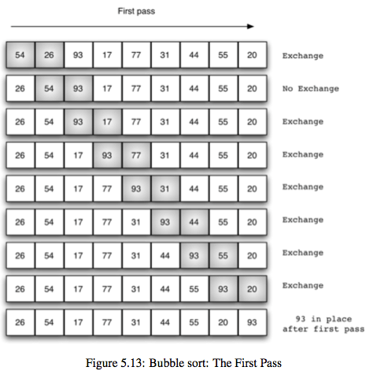
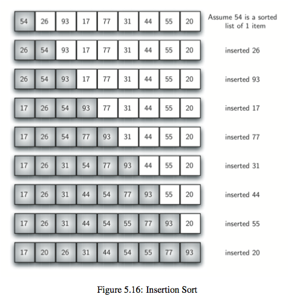
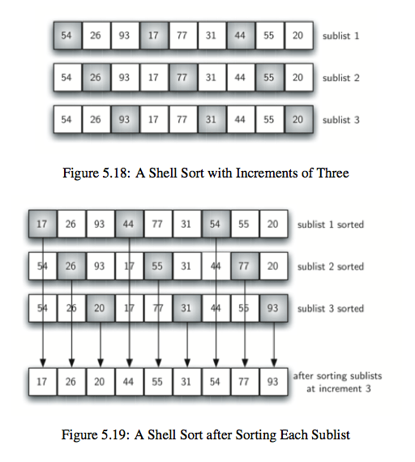
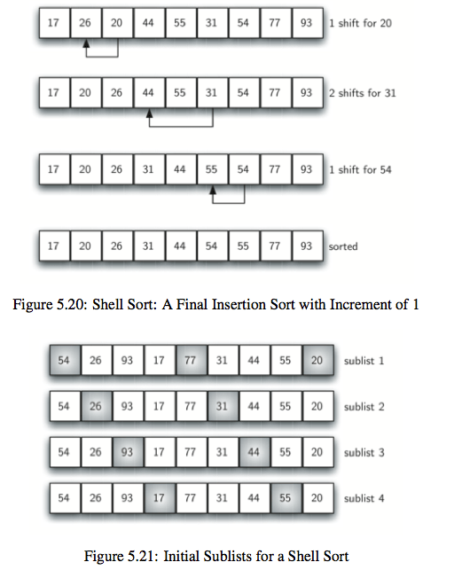
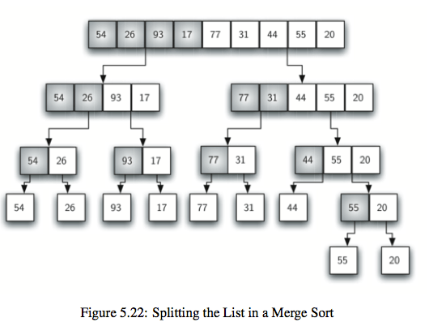
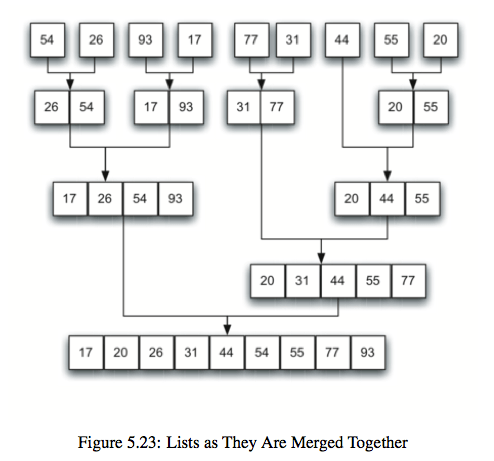
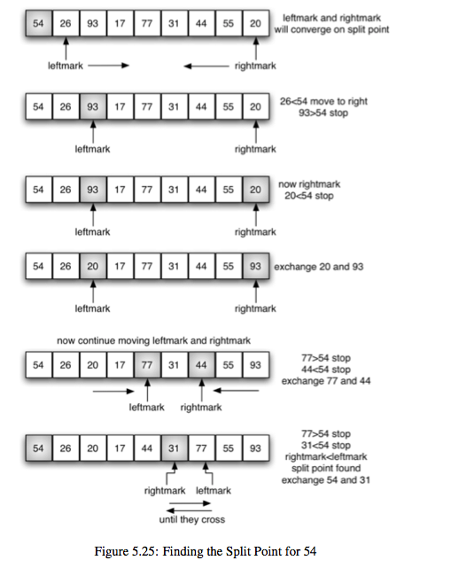

# 排序

## 1. 选择排序

每个回合都选择出剩下的元素中最大的那个，选择的方法是首先默认第一元素是最大的，如果后面的元素比它大的话，那就更新剩下的最大的元素值，
找到剩下元素中最大的之后将它放入到合适的位置就行了。时间复杂度$O(n^2)$

## 2. 冒泡排序
每个回合都从第一个元素开始和它后面的元素比较，如果比它后面的元素更大的话就交换，一直重复，直到这个元素到了它能到达的位置。
每次遍历都将剩下的元素中最大的那个放到了序列的“最后”(除去了前面已经排好的那些元素)。注意检测是否已经完成了排序，如果已完成就可以退出了。
和选择排序类似，只是找剩下的元素中最大的方式不同而已。
时间复杂度$O(n^2)$

## 3. 插入排序

每次都将当前元素插入到左侧已经排序的数组中，使得插入之后左侧数组依然有序。

对于数组 {3, 5, 2, 4, 1}，它具有以下逆序：(3, 2), (3, 1), (5, 2), (5, 4), (5, 1), (2, 1), (4, 1)，插入排序每次只能交换相邻元素，令逆序数量减少 1，因此插入排序需要交换的次数为逆序数量。

插入排序的复杂度取决于数组的初始顺序，如果数组已经部分有序了，逆序较少，那么插入排序会很快。

- 平均情况下插入排序需要 \~N2/4 比较以及 \~N2/4 次交换；
- 最坏的情况下需要 \~N2/2 比较以及 \~N2/2 次交换，最坏的情况是数组是倒序的；
- 最好的情况下需要 N-1 次比较和 0 次交换，最好的情况就是数组已经有序了。

## 4. 希尔排序
对于大规模的数组，插入排序很慢，因为它只能交换相邻的元素，每次只能将逆序数量减少 1。

希尔排序的出现就是为了解决插入排序的这种局限性，它通过交换不相邻的元素，每次可以将逆序数量减少大于 1。

希尔排序使用插入排序对间隔 h 的序列进行排序。通过不断减小 h，最后令 h=1，就可以使得整个数组是有序的。

## 5. 归并排序
典型的是二路合并排序，将原始数据集分成两部分(不一定能够均分)，分别对它们进行排序，然后将排序后的子数据集进行合并，这是典型的分治法策略。
时间复杂度$O(nlogn)$

## 6. 快速排序

首先，它每次都是选择第一个元素都为主元，这个回合就是要确定主元的位置；
然后，有两个指针，一个leftmark指向主元的后面一个位置，另一个rightmark指向要排序的数组最后一个元素；
接着，两个指针分别向中间移动，leftmark遇到比主元大的元素停止，rightmark遇到比主元小的元素停止，
如果此时leftmark<rightmark，也就是说中间还有未处理(未确定与主元大小关系)的元素，那么就交换leftmark和rightmark位置上的元素，
然后重复刚才的移动操作，直到rightmark<leftmark；
最后，停止移动时候rightmark就是主元要放置的位置，因为它停在一个比主元小的元素的位置上，之后交换主元和rightmark指向的元素即可。
完了之后，递归地对主元左右两边的数组进行排序即可。

* 归并排序将数组分为两个子数组分别排序，并将有序的子数组归并使得整个数组排序；
* 快速排序通过一个切分元素将数组分为两个子数组，左子数组小于等于切分元素，右子数组大于等于切分元素，将这两个子数组排序也就将整个数组排序了。

快速排序是原地排序，不需要辅助数组，但是递归调用需要辅助栈。

快速排序最好的情况下是每次都正好能将数组对半分，这样递归调用次数才是最少的。这种情况下比较次数为 CN=2CN/2+N，复杂度为 O(NlogN)。

最坏的情况下，第一次从最小的元素切分，第二次从第二小的元素切分，如此这般。因此最坏的情况下需要比较 N2/2。为了防止数组最开始就是有序的，在进行快速排序时需要随机打乱数组。
## 7. 堆排序

### 7.1 堆
堆的某个节点的值总是大于等于子节点的值，并且堆是一颗完全二叉树。

堆可以用数组来表示，这是因为堆是完全二叉树，而完全二叉树很容易就存储在数组中。
位置 k 的节点的父节点位置为 k/2，而它的两个子节点的位置分别为 2k 和 2k+1。
这里不使用数组索引为 0 的位置，是为了更清晰地描述节点的位置关系。

### 7.2 上浮和下沉
在堆中，当一个节点比父节点大，那么需要交换这个两个节点。
交换后还可能比它新的父节点大，因此需要不断地进行比较和交换操作，把这种操作称为上浮。

类似地，当一个节点比子节点来得小，也需要不断地向下进行比较和交换操作，把这种操作称为下沉。
一个节点如果有两个子节点，应当与两个子节点中最大那么节点进行交换。

### 7.3 堆排序
#### 7.3.1 构建堆
无序数组建立堆最直接的方法是从左到右遍历数组进行上浮操作。一个更高效的方法是从右至左进行下沉操作，如果一个节点的两个节点都已经是堆有序，
那么进行下沉操作可以使得这个节点为根节点的堆有序。
叶子节点不需要进行下沉操作，可以忽略叶子节点的元素，因此只需要遍历一半的元素即可。

#### 7.3.2 交换堆顶元素与最后一个元素
交换之后需要进行下沉操作维持堆的有序状态。

一个堆的高度为 logN，因此在堆中插入元素和删除最大元素的复杂度都为 logN。

对于堆排序，由于要对 N 个节点进行下沉操作，因此复杂度为 NlogN。

堆排序时一种原地排序，没有利用额外的空间。

现代操作系统很少使用堆排序，因为它无法利用局部性原理进行缓存，也就是数组元素很少和相邻的元素进行比较。

## 8. 总结

| 算法 | 稳定性 | 时间复杂度 | 空间复杂度 | 备注 |
| :---: | :---: |:---: | :---: | :---: |
| 选择排序 | × | N2 | 1 | |
| 冒泡排序 | √ |  N2 | 1 | |
| 插入排序 | √ |  N \~ N2 | 1 | 时间复杂度和初始顺序有关 |
| 希尔排序 | ×  |  N 的若干倍乘于递增序列的长度 | 1 | |
| 归并排序 | √ |  NlogN | N | |
| 快速排序 | ×  | NlogN | logN | |
| 堆排序 | ×  |  NlogN | 1 | | |

快速排序是最快的通用排序算法，它的内循环的指令很少，而且它还能利用缓存，因为它总是顺序地访问数据。
它的运行时间近似为 \~cNlogN，这里的 c 比其它线性对数级别的排序算法都要小。